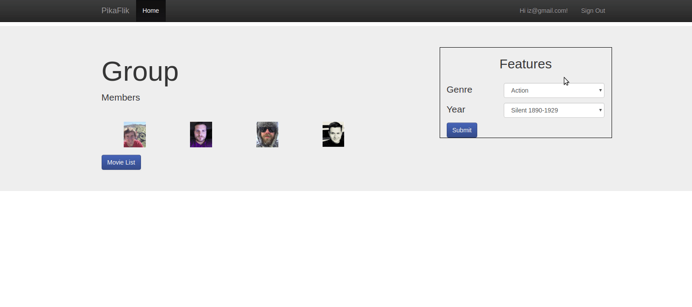
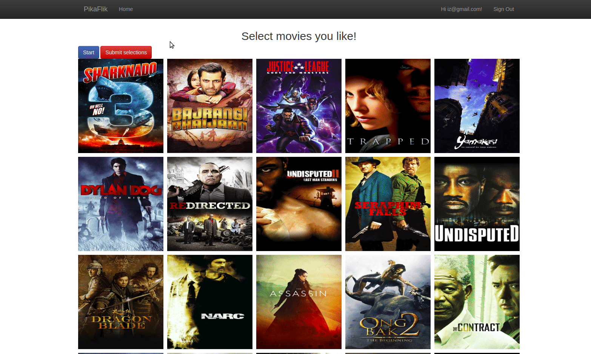

# PikaFlik - A website for friends who love movies.

##  Built with Bootstrap, Firebase, jQuery and API calls to themoviedb.org.

A website to help groups of friends decide on what movie they want to watch by voting on a common list of movies and seeing which movies get the highest votes from your friends.

### How it works

1. Decide on Genre and year range of movies that your whole group of friends will vote on.

2. Then each member will go into the "Movie List" page to see their list of movies based off of their Genre and year range selection.

3. Lastly each member will vote on which movie their interested. When a movie has been selected most, it will be presented as the Top Pick on the home page.

